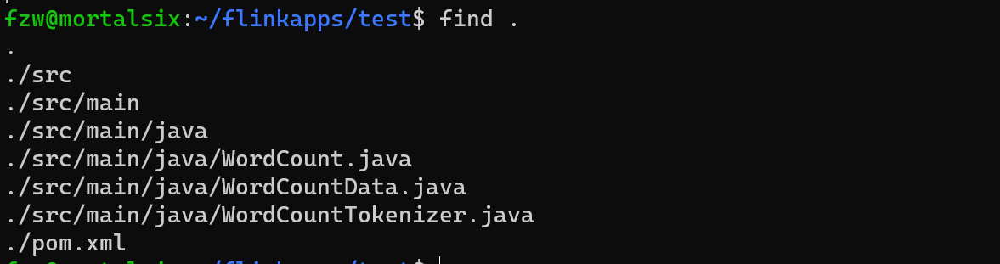
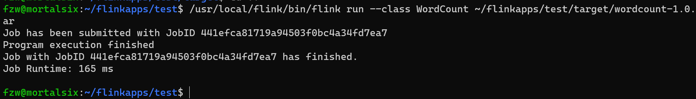

# 1. 安装并配置maven

参考另一文档： [在Linux中安装并配置maven](./在Linux中安装并配置maven.md)

# 2. 创建java应用程序代码目录

```bash
cd ~
mkdir -p ./flinkapps/test # 为你的java应用程序创建一个文件夹，并在其中创建第一个项目 test 
mkdir -p ./flinkapps/test/src/main/java # 在test中创建java程序目录结构
touch ./flinkapps/test/src/main/java/WordCountData.java # 创建java程序文件 1 （数据程序）
touch ./flinkapps/test/src/main/java/WordCountTokenizer.java # 创建java程序文件 2 （处理程序）
touch ./flinkapps/test/src/main/java/WordCount.java # 创建java程序文件 3 （主程序）
```

# 3. 使用合适的编辑器打开java程序文件完成代码编写

在`WordCountData.java`中添加如下代码：

```java
import org.apache.flink.streaming.api.datastream.DataStream;
import org.apache.flink.streaming.api.environment.StreamExecutionEnvironment;

public class WordCountData {
    public static final String[] WORDS=new String[]{"To be, or not to be,--that is the question:--", "Whether \'tis nobler in the mind to suffer", "The slings and arrows of outrageous fortune", "Or to take arms against a sea of troubles,", "And by opposing end them?--To die,--to sleep,--", "No more; and by a sleep to say we end", "The heartache, and the thousand natural shocks", "That flesh is heir to,--\'tis a consummation", "Devoutly to be wish\'d. To die,--to sleep;--", "To sleep! perchance to dream:--ay, there\'s the rub;", "For in that sleep of death what dreams may come,", "When we have shuffled off this mortal coil,", "Must give us pause: there\'s the respect", "That makes calamity of so long life;", "For who would bear the whips and scorns of time,", "The oppressor\'s wrong, the proud man\'s contumely,", "The pangs of despis\'d love, the law\'s delay,", "The insolence of office, and the spurns", "That patient merit of the unworthy takes,", "When he himself might his quietus make", "With a bare bodkin? who would these fardels bear,", "To grunt and sweat under a weary life,", "But that the dread of something after death,--", "The undiscover\'d country, from whose bourn", "No traveller returns,--puzzles the will,", "And makes us rather bear those ills we have", "Than fly to others that we know not of?", "Thus conscience does make cowards of us all;", "And thus the native hue of resolution", "Is sicklied o\'er with the pale cast of thought;", "And enterprises of great pith and moment,", "With this regard, their currents turn awry,", "And lose the name of action.--Soft you now!", "The fair Ophelia!--Nymph, in thy orisons", "Be all my sins remember\'d."};
    public WordCountData() {
    }
    public static DataStream<String> getDefaultTextLineDataStream(StreamExecutionEnvironment senv){
        return senv.fromElements(WORDS);
    }
}
```

在`WordCountTokenizer.java`中添加如下代码：

```java
import org.apache.flink.api.common.functions.FlatMapFunction;
import org.apache.flink.api.java.tuple.Tuple2;
import org.apache.flink.util.Collector;

public class WordCountTokenizer implements FlatMapFunction<String, Tuple2<String,Integer>>{
    public WordCountTokenizer(){}
    public void flatMap(String value, Collector<Tuple2<String, Integer>> out) throws Exception {
        String[] tokens = value.toLowerCase().split("\\W+");
        int len = tokens.length;
        for(int i = 0; i<len;i++){
            String tmp = tokens[i];
            if(tmp.length()>0){
                out.collect(new Tuple2<String, Integer>(tmp,Integer.valueOf(1)));
            }
        }
    }
}
```

在`WordCount.java`中添加如下代码：

```java
import org.apache.flink.api.common.RuntimeExecutionMode;
import org.apache.flink.api.java.tuple.Tuple2;
import org.apache.flink.streaming.api.datastream.DataStream;
import org.apache.flink.streaming.api.environment.StreamExecutionEnvironment;

public class WordCount {
    public WordCount(){}
    public static void main(String[] args) throws Exception {
        StreamExecutionEnvironment senv = StreamExecutionEnvironment.getExecutionEnvironment();
        senv.setRuntimeMode(RuntimeExecutionMode.BATCH);
        Object text;
        text = WordCountData.getDefaultTextLineDataStream(senv);
        DataStream<Tuple2<String, Integer>> counts = ((DataStream<String>)text).flatMap(new WordCountTokenizer())
                .keyBy(0)
                .sum(1);
        counts.print();
        senv.execute();
    }
}
```

# 4. 使用 maven 对 Flink java 应用程序打包

该程序依赖 Flink API，接下来使用通过编写 maven 依赖包文件指定依赖包：

```bash
cd ~/flinkapps/test  # 进入test项目目录
touch pom.xml # 创建 pom.xml 文件
```

使用合适的文本编辑器向 `pom.xml` 文件中添加如下内容：

```xml
<project>
  <groupId>cn.edu.xcu</groupId>
  <artifactId>wordcount</artifactId>
  <modelVersion>4.0.0</modelVersion>
  <name>WordCount</name>
  <packaging>jar</packaging>
  <version>1.0</version>
  <repositories>
    <repository>
      <id>alimaven</id>
      <name>aliyun maven</name>
      <url>https://maven.aliyun.com/nexus/content/groups/public/</url>
    </repository>
  </repositories>
  <dependencies>
    <dependency>
      <groupId>org.apache.flink</groupId>
      <artifactId>flink-streaming-java</artifactId>
      <version>1.16.2</version>
    </dependency>
    <dependency>
      <groupId>org.apache.flink</groupId>
      <artifactId>flink-clients</artifactId>
      <version>1.16.2</version>
    </dependency>
    <dependency>
      <groupId>org.apache.flink</groupId>
      <artifactId>flink-java</artifactId>
      <version>1.16.2</version>
    </dependency>
  </dependencies>
</project>
```

为保证maven编译过程正常运行，先使用如下命令检查应用程序的目录结构：

```bash
cd ~/flinkapps/test
find .
```

结果应该如下所示：



最后，使用maven程序执行编译打包：

```bash
/usr/local/maven/bin/mvn package
```

生成的 jar 包位置在 `~/flinkapps/test/target/wordcount-1.0.jar`


# 5. 将程序提交到 flink 运行

命令如下：

```bash
/usr/local/flink/bin/flink run --class "WordCount" ~/flinkapps/test/target/wordcount-1.0.jar
```

结果如下：

